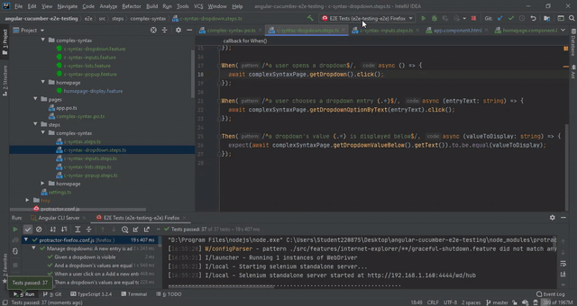
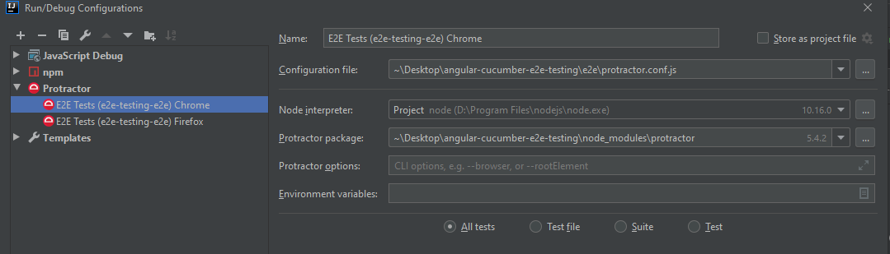
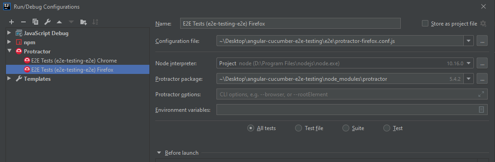

# E2eTesting

This project was generated with [Angular CLI](https://github.com/angular/angular-cli) version 7.3.9.



Tested on:
- Chrome Version 80.0.3987.122 (Official Build) (64-bit)
- Mozilla Firefox 68.0.2 (64-bit)
- npm 6.9.0
- nodejs 10.16.0

## Videos
- YouTube video 1 [2019-08-18]:   
`Protractor & Angular e2e testing tutorial - configuration for Google Chrome and Mozilla Firefox`  
https://www.youtube.com/watch?v=5eN2BBW3SuU&list=PLRkaFIl3mgdUjvs0M-Vw613E2i1dtf-s0&index=1&ab_channel=ShowMeYourCode%21
- YouTube video 2 [2019-09-13]:  
``Angular E2E testing with Protractor - Introduction to Cucumber framework Tutorial``  
https://www.youtube.com/watch?v=jI_moH4I4iw&list=PLRkaFIl3mgdUjvs0M-Vw613E2i1dtf-s0&index=2
- YouTube video 3 [2020-10-25]:  
``Angular E2E testing with Protractor - advanced Cucumber Scenario Outline with Regex | Async Await``   
https://www.youtube.com/watch?v=10EzhlTzkNI&list=PLRkaFIl3mgdUjvs0M-Vw613E2i1dtf-s0&index=3&ab_channel=ShowMeYourCode%21
- YouTube video 4 [2019-11-09]:  
``Angular E2E testing with Protractor - test summary in Cucumber.js | HTML report``  
https://www.youtube.com/watch?v=IYeQG4fR5-Y&list=PLRkaFIl3mgdUjvs0M-Vw613E2i1dtf-s0&index=3&ab_channel=ShowMeYourCode%21

## Project setup
Prerequisites:
1. Node.js installed globally
2. Install Web Manager globally
    - https://www.npmjs.com/package/webdriver-manager

Steps to take:
- Install dependencies using command ``npm install`` from a root project's directory
- Install drivers using command ``npm run webdriver-manager-update`` from package.json
    - Be aware if you have newer versions of browsers, it is very likely that you won't start e2e tests. Be sure that browsers' version matches or install proper drivers

## Starting e2e tests
1. Start Angular Live Development Server
    - `npm run start`
2. Run Protractor (run a command from the root directory)
    - `node node_modules/protractor/bin/protractor e2e/protractor.conf.js`
    - or use a command from `package.json` but you should install Protractor globally first 
        - `npm run protractor-firefox`
    
**You can also try command `ng e2e` which combines starting the development server and Protractor*

## Async await
```
The purpose of async / await is to simplify 
the syntax necessary to consume promise-based APIs. 

Async/await is much more readable and more comfortable to compose. 
Async/await is – such as promise – non-blocking.
```
Reference: https://devsdata.com/async-await-how-it-works/

## Drivers/Selenium server versions
Chrome driver versions
https://chromedriver.chromium.org/

Selenium server versions
https://mvnrepository.com/artifact/or...

Firefox driver versions
https://github.com/mozilla/geckodrive...

## IntelliJ configuration
### Chrome

### Firefox


## Troubleshooting
### Dealing with a wrong driver version
```
[00:06:54] E/launcher - SessionNotCreatedError: session not created: This version of ChromeDriver only supports Chrome version 76
```
If you see such a message, please update the driver version in package.json command ``webdriver-manager-update`` and change `--versions.chrome` to proper one according to a page: https://chromedriver.chromium.org/

### Wrong Chrome/Firefox version even the correct version was fetched
Remove all the drivers and fetch again. You can use command: ``webdriver-manager clean`` or manually remove from `node_modules/protractor/node_modules/selenium`
